# Revised design memo: single-user deployable agent runtime with provider-agnostic agents, team comms, worktrees, and machine execution

## 1. Executive summary

The product should be a **single-user hosted agent runtime**: one operator deploys it on a machine or VPS, authenticates Codex and/or Claude Code credentials, and exposes a public API that any client can drive.

The design goal is not “a backend for one desktop app.” It is:

> A reusable agent runtime microservice that lets web apps, mobile apps, CLIs, or custom tools create agents, stream their work, coordinate teams of agents, send agent-to-agent messages, manage worktrees, and execute real work on the host machine.

The best v1 shape is:

```text
One deployable runtime server
One stable HTTP OpenAPI surface
One realtime event stream
Provider adapters for Codex and Claude Code
Built-in team/comms system
Built-in gg_mcp tool gateway
Built-in process and worktree execution tools
SQLite persistence
Single-user API auth
```

I would **not** optimize around multi-tenant SaaS, complex tenant scoping, or hosted OAuth callback infrastructure. Assume:

* one runtime instance per machine
* one owner/operator
* one public API endpoint
* powerful machine access by design
* clients are untrusted only in the sense that they need an API key/token
* provider-level permission behavior still exists because Codex/Claude need approval semantics, but the runtime itself is intended to control a real machine

The architecture should still keep clean internal boundaries:

* **runtime core** owns normalized sessions, turns, events, teams, messages, deliveries, worktrees, approvals, processes, and recovery
* **provider adapters** own Codex/Claude-specific protocol, auth, transports, sidecars, and event translation
* **tool gateway** owns the provider-facing MCP-compatible tool boundary
* **HTTP server** owns OpenAPI routes, streaming, and client authentication

The important change from the first memo is that **team/comms are now first-class runtime features**, not deferred v2 features. They should be modeled as core entities with public API endpoints and provider-facing `gg_team_*` tools.

---

## 2. Product shape

### Recommended product identity

Call it something like:

```text
gg-runtime
```

or:

```text
goose-runtime
```

The product should feel like:

```text
docker run / binary run
authenticate Codex or Claude
create sessions
create teams
spawn agents
stream events
send direct/broadcast messages
let agents run tools and processes
inspect all state through an API
```

This is closer to “agent operating runtime” than “SDK.”

### Primary interface

The primary interface should be:

1. **HTTP JSON API described by OpenAPI**
2. **SSE stream for replayable events**
3. Optional **WebSocket convenience endpoint** that multiplexes the same event bus for clients that prefer sockets

I would not make gRPC the primary interface. The likely clients are Next.js, mobile apps, browser UIs, CLIs, and scripts. OpenAPI + JSON + SSE is easier to consume everywhere.

### Embeddable Rust SDK

A Rust SDK can still exist internally, but it should not drive the product design. The server API is the product contract.

The crate structure can support internal reuse, but the v1 priority should be:

```text
runtime-server + OpenAPI + provider adapters + team/comms + tools
```

not a polished Rust client SDK.

---

## 3. Revised architecture principles

### Principle 1: single-user hosted, not multi-tenant SaaS

Do not design around tenants, organizations, per-user isolation, external secret managers, or SaaS account provisioning.

Instead:

* one owner
* one runtime config
* one data directory
* one SQLite database
* one set of provider credentials per provider, with optional named credential profiles later
* one machine-level tool/process/worktree environment

The runtime may expose API keys with scopes, but those scopes are for client control and safety, not tenant isolation.

### Principle 2: powerful machine access is the point

This runtime exists so agents can do real work on a real machine.

Therefore, include:

* process execution
* filesystem access through provider/tooling
* worktree creation and cleanup
* repo-specific bootstrapping scripts
* MCP tool gateway
* agent-to-agent messaging
* team-managed spawning
* long-running process tracking
* restart recovery

There should still be configuration guardrails, but not heavy sandbox architecture in v1.

### Principle 3: team/comms are core

Teams, messages, deliveries, delivery policies, member lifecycle, and agent-spawning workflows should be built into the runtime API and available to agents through tools.

The current Golden Goose backend’s team/comms system is not just UI state. It is real runtime orchestration:

* teams have lead agents and members
* agents can direct-message or broadcast to teammates
* messages produce per-recipient delivery records
* deliveries may be injected immediately, deferred, retried, cancelled, or failed
* delivery injection must coordinate with the recipient’s active turn
* tools can create/manage teammates
* worktrees can be created for spawned agents
* lifecycle and compaction events can trigger team notifications

That should be preserved.

### Principle 4: provider-agnostic core, provider-specific adapters

Keep Codex and Claude behind a narrow normalized provider adapter.

The core should not care whether:

* Codex uses app-server transports
* Claude requires a Bun sidecar
* Claude auth came from an imported `auth.json`
* Codex auth came from OAuth
* approval semantics differ internally

The core should see:

```text
session
turn
event
approval
tool call
message
delivery
process
worktree
```

### Principle 5: append-only events plus materialized state

Use durable events for replay and streaming, plus SQLite tables for current state.

Every client should be able to:

* open a session stream
* reconnect after network loss
* replay events from a sequence number
* fetch current materialized state
* inspect historical turns/messages/deliveries/processes

---

## 4. What the current backend does well and should be preserved

### Provider registry and provider traits

The current `AgentProvider` and `ProviderRegistry` approach is strong. Preserve:

* provider kind registry
* provider capability discovery
* model listing
* create/resume session
* send input
* interrupt turn
* respond approval
* close session
* provider event sink
* provider-specific recovery hooks
* provider auth lifecycle hooks

Change the public names and request structs, but keep the same conceptual interface.

### Codex app-server architecture

Preserve the Codex patterns:

* pooled app-server transports
* separate auth transport
* admission control for max sessions/transports
* request/response maps with timeout cleanup
* fail-closed provider event routing
* thread owner and turn owner binding
* critical event forwarding
* bounded live event queues
* model cache with refresh/cache-only modes
* provider-specific interrupt reconciliation

This should be the first provider to implement in the new runtime.

### Claude bridge sidecar architecture

Preserve the Claude sidecar idea.

Claude Code’s usable SDK/runtime path is not Rust-native. It depends on a JS/Bun environment, so the standalone runtime should intentionally include a sidecar package:

```text
runtime-provider-claude
  spawns
claude-bridge sidecar
  uses
Claude Code SDK / CLI environment
```

The Rust server should manage the bridge process lifecycle:

* spawn
* heartbeat
* request/response IDs
* session mapping
* stdout/stderr lanes
* pending request draining on failure
* bridge restart
* bridge pool if needed
* per-session event sequence checks

### MCP tool gateway

The `gg-mcp-server` concept is essential and should be included in v1.

Preserve:

* provider-facing tool boundary
* bearer token between provider sidecar/app-server and runtime
* namespace routing
* body-size limits
* caller agent/session identity
* structured tool results
* support for `gg_process_*`
* support for `gg_team_*`
* future support for markdown/workspace tools

The runtime should own the tool implementations. Providers should only see MCP-compatible tools.

### Process manager

Preserve as first-class:

* spawn process
* list process
* get status
* get logs
* kill process
* per-session ownership
* stdout/stderr capture
* timeouts
* retained logs
* process events
* tool-call correlation

In this product, process execution is not a risky optional add-on. It is one of the core reasons the runtime exists.

### Team/comms broker

Preserve and elevate:

* `TeamService`
* `CommsBroker`
* team lifecycle
* team membership
* direct and broadcast messages
* message priority
* delivery policy
* per-recipient delivery records
* pending/deferred/injecting/injected/failed/cancelled delivery lifecycle
* idempotency keys
* correlation IDs
* delivery replay/query
* telemetry
* per-recipient injection guards
* delivery retry/cancel
* team operation diagnostics
* compaction notifications
* `gg_team_status`
* `gg_team_message`
* `gg_team_manage`

### Managed worktrees

Preserve and expose:

* native git worktree creation
* branch/worktree naming policy
* per-repo locks
* managed worktree records
* claim tracking by session
* deletion policy
* startup repair
* cleanup on member removal
* reuse of existing worktrees
* worktree init script execution

The current worktree init script path is:

```text
.agents/gg/worktree-init.sh
```

That is a useful convention to keep.

---

## 5. What should not be copied

Even with team/comms included, avoid copying these desktop-specific pieces directly:

### Do not copy Tauri command surfaces

Replace Tauri commands with a stable OpenAPI surface.

The new API should be named for public concepts:

```text
sessions
turns
events
providers
auth
teams
messages
deliveries
processes
worktrees
tools
```

not desktop command handlers.

### Do not copy UI projection complexity as the API contract

Keep event projection internally if useful, but the public API should expose:

* current state queries
* append-only runtime events
* team view snapshots
* session/turn/message/delivery records

Clients can project their own UI.

### Do not copy desktop feature flags

In this runtime, these are core features:

```text
agent_teams_enabled = true
agent_comms_enabled = true
gg_mcp_enabled = true
process_tools_enabled = true
managed_worktrees_enabled = true
```

Feature flags can remain for debugging, but not as product-level optionality.

### Do not overbuild security isolation

Do not design multi-tenant isolation, per-tenant provider pools, SaaS billing, or remote sandbox workers.

Do keep:

* API authentication
* secret redaction
* HTTPS/reverse-proxy compatibility
* audit logs
* operator-configurable allow/deny policies
* explicit “dangerous machine access” documentation

### Do not build gRPC first

gRPC is good for internal distributed systems, but this product wants broad client compatibility. OpenAPI is the right primary contract.

---

## 6. Recommended clean-sheet architecture

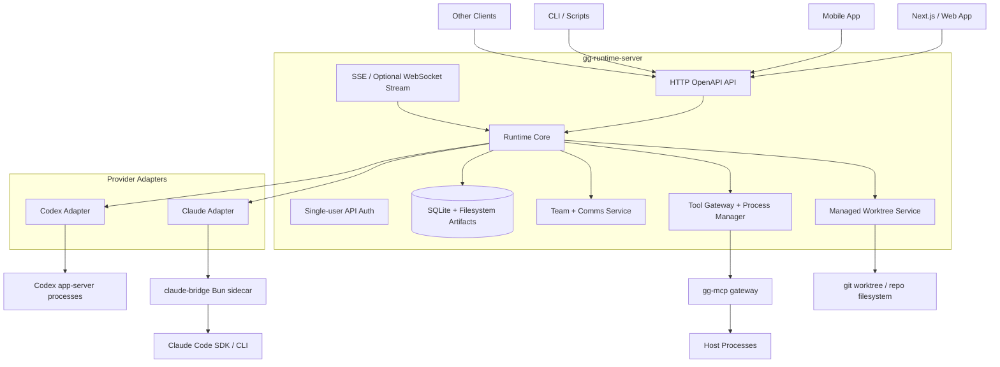

### Internal component model

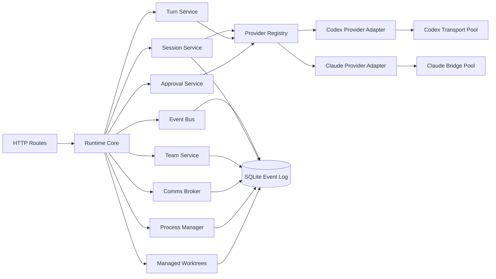

### Provider boundary

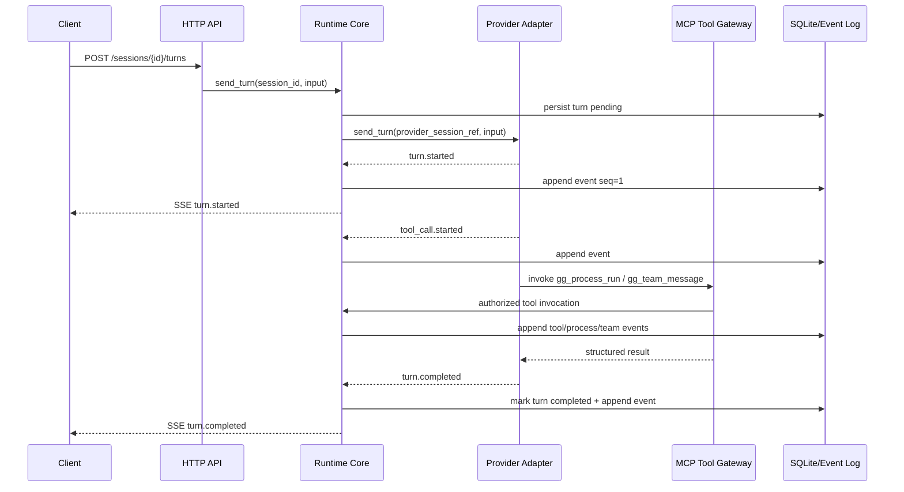

---

## 7. Proposed workspace layout

This remains a Rust workspace, but the public contract is HTTP.

```text
gg-runtime/
  Cargo.toml

  crates/
    runtime-core/
      src/
        lib.rs
        ids.rs
        error.rs
        config.rs

        provider.rs
        provider_registry.rs
        provider_events.rs

        auth.rs
        credentials.rs

        sessions.rs
        turns.rs
        approvals.rs
        events.rs

        teams.rs
        comms.rs
        deliveries.rs
        team_operations.rs

        worktrees.rs
        tools.rs
        processes.rs

        recovery.rs
        audit.rs
        metrics.rs

    runtime-store-sqlite/
      src/
        lib.rs
        migrations.rs
        repo.rs
        event_log.rs
        session_repo.rs
        team_repo.rs
        comms_repo.rs
        process_repo.rs
        worktree_repo.rs
        credential_repo.rs

    runtime-provider-codex/
      src/
        lib.rs
        auth.rs
        app_server.rs
        transport.rs
        pool.rs
        routing.rs
        events.rs
        models.rs
        recovery.rs

    runtime-provider-claude/
      src/
        lib.rs
        auth.rs
        bridge.rs
        bridge_pool.rs
        protocol.rs
        events.rs
        models.rs
        recovery.rs

    runtime-tools/
      src/
        lib.rs
        mcp_gateway.rs
        process_manager.rs
        process_logs.rs
        team_tools.rs
        markdown_tools.rs
        tool_specs.rs

    runtime-server/
      src/
        main.rs
        config.rs
        openapi.rs
        app.rs
        authn.rs
        sse.rs
        websocket.rs

        routes/
          health.rs
          providers.rs
          auth.rs
          sessions.rs
          turns.rs
          events.rs
          approvals.rs
          teams.rs
          messages.rs
          deliveries.rs
          processes.rs
          worktrees.rs
          tools.rs
          diagnostics.rs

  sidecars/
    gg-mcp-server/
    claude-bridge/
```

### Why keep separate crates?

Because the design still needs clean boundaries:

* `runtime-core`: state machines and invariants
* `runtime-store-sqlite`: persistence
* `runtime-provider-codex`: Codex-specific mechanics
* `runtime-provider-claude`: Claude-specific mechanics
* `runtime-tools`: MCP/process/team tool implementations
* `runtime-server`: API, streaming, config, auth

But for v1 product delivery, publish/run one binary:

```text
gg-runtime-server
```

---

## 8. Runtime state model

## 8.1 Session

A session is one live or resumable provider-backed agent.

```text
session_id
provider
credential_profile
status
cwd
model
permission_mode
system_prompt
metadata_json
provider_session_ref
canonical_provider_session_ref
active_turn_id
created_at
updated_at
closed_at
failure_code
failure_message
```

Statuses:

```text
created
ready
turn_running
waiting_for_approval
failed
closed
archived
```

Invariants:

* a session has exactly one provider
* a session has at most one active turn
* active turn ownership is explicit
* provider refs are opaque to core
* terminal session state is idempotent
* a failed turn does not necessarily fail the session
* a closed session does not accept new turns

## 8.2 Turn

```text
turn_id
session_id
provider_turn_ref
status
input_json
source
started_at
completed_at
usage_json
error_json
```

Statuses:

```text
pending
in_progress
waiting_for_approval
completed
interrupted
failed
desynced
```

Invariants:

* one active turn per session
* one terminal state per turn
* duplicate terminal event with same state is idempotent
* conflicting terminal state is a protocol error
* late events must pass session/turn ownership checks

## 8.3 Event

The runtime needs two overlapping event concepts:

1. **session runtime events**
2. **team/comms view events**

Both should use a common durable event log pattern.

```text
event_id
scope              session | team | process | worktree | system
scope_id
session_id
team_id
turn_id
seq
kind
critical
payload_json
provider
provider_seq
created_at
```

Examples:

```text
session.created
session.started
session.resumed
session.closed

turn.started
turn.delta
turn.completed
turn.failed
turn.interrupted

approval.requested
approval.resolved

tool_call.started
tool_call.completed
tool_call.failed

process.started
process.output
process.completed
process.killed

team.created
team.member_joined
team.member_left
team.lead_changed
team.deleted

team_message.created
team_delivery.pending
team_delivery.deferred
team_delivery.injecting
team_delivery.injected
team_delivery.failed
team_delivery.cancelled

worktree.created
worktree.claimed
worktree.released
worktree.cleaned_up
worktree.cleanup_failed
```

Invariants:

* core assigns event IDs and sequence numbers
* critical state-changing events are never dropped
* stream subscribers may miss deltas but can replay from SQLite
* every materialized state mutation should have a corresponding event

## 8.4 Approval

```text
approval_id
session_id
turn_id
tool_call_id
provider_approval_ref
status
request_json
response_json
created_at
resolved_at
```

Statuses:

```text
pending
accepted
declined
expired
cancelled
failed
```

Invariants:

* only pending approvals can be resolved
* approval result is auditable
* provider approval ref is opaque
* approvals survive restart

## 8.5 Team

Teams are first-class.

```text
team_id
name
lead_agent_id
created_by
created_at
updated_at
deleted_at
```

Team member:

```text
team_id
agent_id
title
joined_at
added_by
creator_agent_id
creator_compaction_subscription
managed_worktree_id
```

Invariants:

* a team has one lead agent
* lead is always a member
* each member maps to an agent session
* team membership changes emit events
* agent-originated membership changes must obey team policy
* removing a member can trigger managed worktree release/cleanup

## 8.6 Team message

```text
message_id
team_id
scope                 direct | broadcast
sender_agent_id
recipient_agent_ids_json
input_json
image_paths_json
priority              low | normal | high | urgent
policy                non_interrupting | interrupt_after_tool_boundary | immediate_interrupt | start_new_turn_only
correlation_id
reply_to_message_id
idempotency_key
created_at
```

Invariants:

* message sender must be a team member
* recipients must be team members
* direct has one recipient
* broadcast expands to per-recipient deliveries
* idempotency key dedupes repeat sends from same sender/team/scope
* messages are immutable after creation except cancellation state via deliveries

## 8.7 Delivery

A delivery is a per-recipient attempt to inject a team message into an agent session.

```text
delivery_id
message_id
team_id
recipient_agent_id
provider
status
effective_policy
injection_strategy
injected_turn_id
last_error_code
last_error_message
created_at
updated_at
```

Statuses:

```text
pending
deferred
injecting
injected
failed
cancelled
```

Delivery policies:

```text
non_interrupting
interrupt_after_tool_boundary
immediate_interrupt
start_new_turn_only
```

Invariants:

* every recipient gets its own delivery record
* only pending/deferred deliveries are injectable
* a recipient should have a per-session injection guard
* delivery injection must coordinate with active turn state
* failed delivery does not invalidate the message
* delivery retry should be explicit and idempotent

## 8.8 Managed worktree

```text
worktree_id
repo_root
worktree_root
worktree_cwd
branch_name
worktree_name
unified_workspace_path
created_by_session_id
created_by_operation_id
deletion_policy          retain_on_last_claim | delete_on_last_claim
created_at
updated_at
```

Worktree claim:

```text
worktree_id
session_id
claim_role               owner | consumer
created_at
released_at
```

Invariants:

* worktree identity key is `(repo_root, worktree_cwd, branch_name)`
* one session cannot claim multiple conflicting managed worktrees
* worktree cleanup occurs only after final claim release
* cleanup is idempotent
* per-repo locks protect git worktree operations
* startup repair normalizes persisted records
* reused existing worktrees should not be deleted unless the runtime created them

---

## 9. Team/comms architecture

The team/comms system should have both public APIs and agent tools.

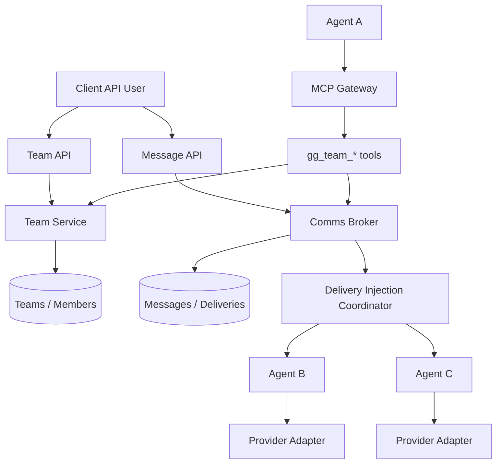

### Public API use cases

Clients should be able to:

* create a team from existing sessions
* ensure a session has a team
* list teams
* get team state
* join/leave/remove members
* set lead
* spawn a new member from an existing session
* create a new member with a managed worktree
* send direct message
* broadcast message
* list messages
* get team view snapshot
* list team events since cursor
* inspect deliveries
* retry delivery
* cancel message
* interrupt all team members
* query diagnostics

### Agent tool use cases

Agents should be able to call:

```text
gg_team_status
gg_team_message
gg_team_manage
```

Recommended semantics:

#### `gg_team_status`

Returns:

* current team
* role/title
* lead
* members
* pending deliveries
* useful tool instructions
* model presets if configured
* worktree metadata if relevant

#### `gg_team_message`

Supports:

* direct message
* broadcast
* optional images
* priority
* delivery policy
* correlation ID
* idempotency key
* reply-to message ID

#### `gg_team_manage`

Supports:

* add member
* remove member
* optional title
* optional prompt/onboarding message
* optional model preset
* optional worktree name
* optional use existing worktree
* optional worktree init hook
* creator compaction subscription

The important behavior to preserve is that adding a teammate is not just creating a session. It can:

1. derive a new worktree
2. create branch/worktree
3. run pre-add hooks
4. create agent session
5. join member to team
6. deliver onboarding message
7. record operation journal
8. rollback on partial failure

### Delivery injection state machine

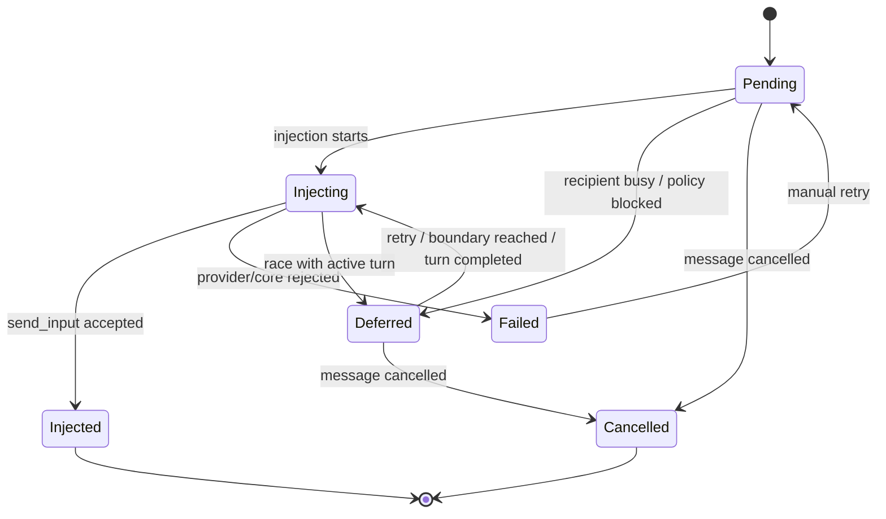

### Delivery policy semantics

| Policy                          | Meaning                                                                 |
| ------------------------------- | ----------------------------------------------------------------------- |
| `start_new_turn_only`           | Deliver only if recipient is idle. Otherwise defer.                     |
| `non_interrupting`              | Deliver when recipient becomes safe/idle.                               |
| `interrupt_after_tool_boundary` | Wait for a safe boundary, then interrupt/inject.                        |
| `immediate_interrupt`           | Interrupt the recipient’s active turn as soon as possible, then inject. |

This policy belongs in runtime core, not provider adapters.

Provider adapters only receive normal `send_turn` / `interrupt_turn` commands.

---

## 10. Worktree architecture

Worktrees should be first-class because multi-agent work requires isolation.

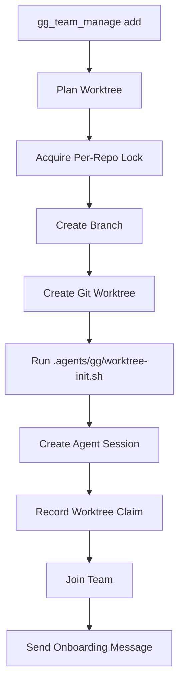

### Worktree creation request

Public API should allow explicit worktree creation:

```http
POST /v1/worktrees
```

Example:

```json
{
  "repo_root": "/srv/projects/my-app",
  "worktree_name": "frontend-agent",
  "branch_prefix": "gg",
  "base_ref": "main",
  "deletion_policy": "delete_on_last_claim",
  "run_init_script": true
}
```

But the most important worktree path is through teammate spawning:

```http
POST /v1/teams/{team_id}/members/spawn
```

Example:

```json
{
  "source_session_id": "sess_lead",
  "title": "Frontend implementer",
  "provider": "claude",
  "model": "claude-sonnet-4",
  "prompt": "Implement the Next.js UI changes.",
  "worktree": {
    "mode": "create",
    "name": "frontend-ui",
    "branch_prefix": "gg",
    "run_init_script": true
  }
}
```

### Worktree cleanup

Cleanup should be explicit and safe:

* removing a team member releases the member’s claim
* if this was the last claim and deletion policy is `delete_on_last_claim`, cleanup may delete the git worktree and branch
* reused existing worktrees should release claims but not delete artifacts
* cleanup failures should not undo member removal
* cleanup failures should be reported as operation diagnostics

### Worktree startup repair

On server startup:

1. load worktree records
2. normalize identity fields
3. merge duplicate records deterministically
4. rebuild session claim indexes
5. compare against live session/team state
6. drop invalid claims
7. persist normalized records if needed
8. emit repair diagnostics

This is important because a VPS runtime will be restarted often.

---

## 11. Provider integration model

## 11.1 Provider adapter trait

```rust
#[async_trait::async_trait]
pub trait ProviderAdapter: Send + Sync {
    fn kind(&self) -> ProviderKind;
    fn capabilities(&self) -> ProviderCapabilities;

    async fn list_models(
        &self,
        req: ListModelsRequest,
    ) -> Result<ListModelsResponse, RuntimeError>;

    async fn open_session(
        &self,
        req: OpenProviderSession,
        sink: ProviderEventSink,
    ) -> Result<ProviderSessionBinding, RuntimeError>;

    async fn resume_session(
        &self,
        req: ResumeProviderSession,
        sink: ProviderEventSink,
    ) -> Result<ProviderSessionBinding, RuntimeError>;

    async fn send_turn(
        &self,
        req: ProviderSendTurn,
    ) -> Result<ProviderTurnAck, RuntimeError>;

    async fn interrupt_turn(
        &self,
        req: ProviderInterruptTurn,
    ) -> Result<(), RuntimeError>;

    async fn respond_approval(
        &self,
        req: ProviderApprovalResponse,
    ) -> Result<(), RuntimeError>;

    async fn close_session(
        &self,
        req: ProviderCloseSession,
    ) -> Result<(), RuntimeError>;

    async fn inspect_recovery(
        &self,
        req: ProviderRecoveryInspection,
    ) -> Result<ProviderRecoveryStatus, RuntimeError>;
}
```

### Provider boundary invariants

* provider owns provider session refs
* provider owns provider turn refs
* runtime owns runtime session/turn IDs
* provider emits normalized events
* runtime validates ownership before applying provider events
* provider events that cannot be mapped fail closed
* provider-specific metadata remains opaque JSON or typed provider option structs

## 11.2 Codex provider

Codex should be implemented first.

Codex internals:

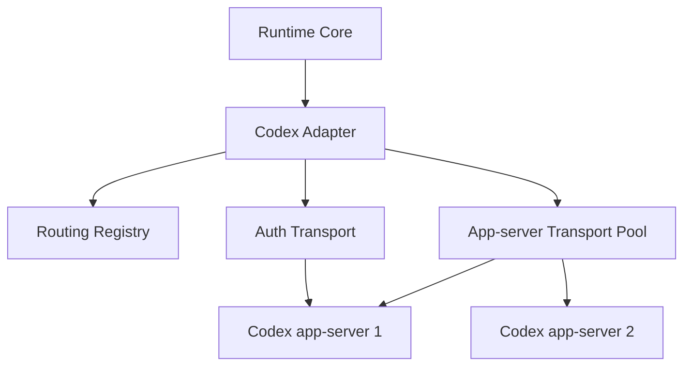

Preserve:

* separate auth transport
* pooled app-server transports
* transport/session admission
* least-loaded transport selection
* request timeouts
* fail-closed routing
* critical event forwarder
* interrupt reconciliation
* model cache

Codex auth should support:

```text
chatgpt_oauth
api_key
logout
status
rate_limits
```

## 11.3 Claude provider

Claude requires a separate approach because the Claude agent SDK is not Rust-native and is effectively Bun/JS-side.

Architecture:

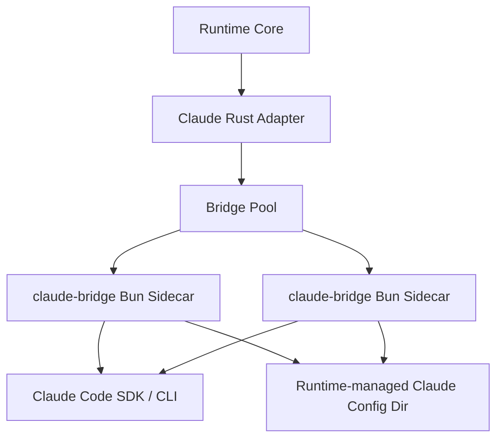

The Rust adapter should manage:

* bridge spawn
* bridge protocol
* request IDs
* session references
* event translation
* heartbeat
* process failure
* request draining
* restart/recovery
* per-session sequence enforcement

The Bun sidecar should own:

* Claude Code SDK calls
* Claude-specific event stream parsing
* Claude-specific auth config layout
* any JS-only SDK dependency

### Claude auth model

Keep it simple. Support exactly:

1. **Anthropic API key**
2. **Imported Claude Code auth JSON**

No fake OAuth flow.

Recommended auth endpoints:

```http
GET  /v1/providers/claude/auth/status
POST /v1/providers/claude/auth/api-key
POST /v1/providers/claude/auth/import-json
POST /v1/providers/claude/auth/logout
```

API key body:

```json
{
  "api_key": "sk-ant-..."
}
```

Imported JSON body:

```json
{
  "auth_json": {
    "...": "contents of local Claude Code auth.json"
  }
}
```

Also support raw text paste:

```json
{
  "auth_json_text": "{ ... raw auth.json text ... }"
}
```

And multipart upload:

```http
POST /v1/providers/claude/auth/import-file
Content-Type: multipart/form-data
file=@auth.json
```

The runtime should write this into a **runtime-managed Claude config directory**, not depend on the server operator’s global `~/.claude`.

Example:

```text
~/.gg-runtime/providers/claude/config/auth.json
```

Then every Claude bridge process should run with:

```text
CLAUDE_CONFIG_DIR=~/.gg-runtime/providers/claude/config
```

If Claude Code expects additional JSON files later, support importing a bundle:

```json
{
  "files": [
    {
      "relative_path": "auth.json",
      "contents": { "...": "..." }
    }
  ]
}
```

But v1 can start with `auth.json`.

### Claude auth status response

```json
{
  "provider": "claude",
  "authenticated": true,
  "auth_modes": ["claude_code_auth_json"],
  "config_dir": "/home/gg/.gg-runtime/providers/claude/config",
  "auth_json_present": true,
  "api_key_present": false,
  "last_imported_at": "2026-05-05T10:00:00Z"
}
```

---

## 12. Auth model for the runtime API itself

This is single-user hosted, but it will have a public API endpoint, so the runtime still needs API authentication.

Recommended v1:

```text
Bearer token API auth
```

Config:

```toml
[server]
bind = "0.0.0.0:8080"
public_base_url = "https://agents.example.com"

[auth]
mode = "static_bearer"
token_file = "/var/lib/gg-runtime/api-token"
```

Every client sends:

```http
Authorization: Bearer <runtime-api-token>
```

Optional v1.1:

* multiple API tokens
* token names
* token scopes
* token last-used timestamp

Scopes can be simple:

```text
admin
sessions:read
sessions:write
teams:read
teams:write
processes:read
processes:write
auth:write
```

But do not build multi-user identity.

---

## 13. Realtime API decision

### Recommended v1 transport

Use:

```text
REST/OpenAPI for commands and queries
SSE for event streaming
```

SSE is the authoritative realtime stream because it is naturally replayable:

```http
GET /v1/events/stream
GET /v1/sessions/{session_id}/events/stream
GET /v1/teams/{team_id}/events/stream
```

Support:

```http
Last-Event-ID: <event_seq_or_id>
```

and query form:

```http
GET /v1/events/stream?after_seq=123
```

### Optional WebSocket

Add WebSocket as a convenience layer, not as the source of truth:

```http
GET /v1/realtime
```

WebSocket should multiplex the same events:

```json
{
  "type": "subscribe",
  "scope": "team",
  "team_id": "team_1",
  "after_seq": 100
}
```

Server event:

```json
{
  "type": "event",
  "event": {
    "event_id": "evt_...",
    "kind": "team_message.created",
    "payload": {}
  }
}
```

Do not make WebSocket commands separate from REST in v1. Clients should use REST for mutations, WebSocket/SSE for updates.

### Why not gRPC?

gRPC is unnecessary for v1 because:

* browser clients need HTTP/JSON anyway
* OpenAPI is easier for Next.js and mobile clients
* SSE replay is simpler than bidirectional streaming
* provider/runtime internals are local to one process

---

## 14. Public HTTP API surface

## 14.1 Top-level endpoint groups

```text
/health
/version

/v1/providers
/v1/providers/{provider}/models
/v1/providers/{provider}/auth/*

/v1/sessions
/v1/sessions/{session_id}
/v1/sessions/{session_id}/turns
/v1/sessions/{session_id}/events
/v1/sessions/{session_id}/events/stream
/v1/sessions/{session_id}/approvals

/v1/teams
/v1/teams/{team_id}
/v1/teams/{team_id}/members
/v1/teams/{team_id}/members/spawn
/v1/teams/{team_id}/messages
/v1/teams/{team_id}/broadcasts
/v1/teams/{team_id}/deliveries
/v1/teams/{team_id}/events
/v1/teams/{team_id}/events/stream
/v1/teams/{team_id}/view
/v1/teams/{team_id}/interrupt-all

/v1/processes
/v1/processes/{process_id}
/v1/processes/{process_id}/logs
/v1/processes/{process_id}/kill

/v1/worktrees
/v1/worktrees/{worktree_id}
/v1/worktrees/{worktree_id}/claims
/v1/worktrees/{worktree_id}/cleanup

/v1/tools
/v1/tools/{tool_name}/invoke

/v1/events
/v1/events/stream

/v1/diagnostics
/v1/diagnostics/comms
/v1/diagnostics/team-operations
```

---

## 15. OpenAPI draft

This is not a complete final generated spec, but it is concrete enough to drive implementation.

```yaml
openapi: 3.1.0
info:
  title: GG Runtime API
  version: 0.1.0
  description: >
    Single-user hosted provider-agnostic agent runtime API for Codex, Claude Code,
    team communication, process execution, and managed worktrees.

servers:
  - url: https://agents.example.com

security:
  - bearerAuth: []

tags:
  - name: Health
  - name: Providers
  - name: ProviderAuth
  - name: Sessions
  - name: Turns
  - name: Events
  - name: Approvals
  - name: Teams
  - name: Messages
  - name: Deliveries
  - name: Processes
  - name: Worktrees
  - name: Tools
  - name: Diagnostics

paths:
  /health:
    get:
      tags: [Health]
      security: []
      operationId: getHealth
      responses:
        "200":
          description: Runtime health
          content:
            application/json:
              schema:
                $ref: "#/components/schemas/HealthResponse"

  /version:
    get:
      tags: [Health]
      operationId: getVersion
      responses:
        "200":
          description: Runtime version
          content:
            application/json:
              schema:
                $ref: "#/components/schemas/VersionResponse"

  /v1/providers:
    get:
      tags: [Providers]
      operationId: listProviders
      responses:
        "200":
          description: Provider list
          content:
            application/json:
              schema:
                type: object
                properties:
                  providers:
                    type: array
                    items:
                      $ref: "#/components/schemas/ProviderInfo"
                required: [providers]

  /v1/providers/{provider}/models:
    get:
      tags: [Providers]
      operationId: listProviderModels
      parameters:
        - $ref: "#/components/parameters/Provider"
        - name: refresh
          in: query
          schema:
            type: boolean
            default: false
      responses:
        "200":
          description: Provider models
          content:
            application/json:
              schema:
                $ref: "#/components/schemas/ModelListResponse"

  /v1/providers/codex/auth/status:
    get:
      tags: [ProviderAuth]
      operationId: getCodexAuthStatus
      responses:
        "200":
          description: Codex auth status
          content:
            application/json:
              schema:
                $ref: "#/components/schemas/CodexAuthStatus"

  /v1/providers/codex/auth/start:
    post:
      tags: [ProviderAuth]
      operationId: startCodexAuth
      requestBody:
        required: true
        content:
          application/json:
            schema:
              $ref: "#/components/schemas/CodexAuthStartRequest"
      responses:
        "200":
          description: Codex auth started
          content:
            application/json:
              schema:
                $ref: "#/components/schemas/CodexAuthStartResponse"

  /v1/providers/codex/auth/api-key:
    post:
      tags: [ProviderAuth]
      operationId: setCodexApiKey
      requestBody:
        required: true
        content:
          application/json:
            schema:
              type: object
              required: [api_key]
              properties:
                api_key:
                  type: string
                  format: password
      responses:
        "200":
          description: Codex auth status
          content:
            application/json:
              schema:
                $ref: "#/components/schemas/CodexAuthStatus"

  /v1/providers/codex/auth/cancel:
    post:
      tags: [ProviderAuth]
      operationId: cancelCodexAuth
      requestBody:
        required: true
        content:
          application/json:
            schema:
              type: object
              required: [login_id]
              properties:
                login_id:
                  type: string
      responses:
        "204":
          description: Cancelled

  /v1/providers/codex/auth/logout:
    post:
      tags: [ProviderAuth]
      operationId: logoutCodex
      responses:
        "204":
          description: Logged out

  /v1/providers/claude/auth/status:
    get:
      tags: [ProviderAuth]
      operationId: getClaudeAuthStatus
      responses:
        "200":
          description: Claude auth status
          content:
            application/json:
              schema:
                $ref: "#/components/schemas/ClaudeAuthStatus"

  /v1/providers/claude/auth/api-key:
    post:
      tags: [ProviderAuth]
      operationId: setClaudeApiKey
      requestBody:
        required: true
        content:
          application/json:
            schema:
              type: object
              required: [api_key]
              properties:
                api_key:
                  type: string
                  format: password
      responses:
        "200":
          description: Claude auth status
          content:
            application/json:
              schema:
                $ref: "#/components/schemas/ClaudeAuthStatus"

  /v1/providers/claude/auth/import-json:
    post:
      tags: [ProviderAuth]
      operationId: importClaudeAuthJson
      requestBody:
        required: true
        content:
          application/json:
            schema:
              oneOf:
                - type: object
                  required: [auth_json]
                  properties:
                    auth_json:
                      type: object
                      additionalProperties: true
                - type: object
                  required: [auth_json_text]
                  properties:
                    auth_json_text:
                      type: string
      responses:
        "200":
          description: Claude auth status
          content:
            application/json:
              schema:
                $ref: "#/components/schemas/ClaudeAuthStatus"

  /v1/providers/claude/auth/import-file:
    post:
      tags: [ProviderAuth]
      operationId: importClaudeAuthFile
      requestBody:
        required: true
        content:
          multipart/form-data:
            schema:
              type: object
              required: [file]
              properties:
                file:
                  type: string
                  format: binary
      responses:
        "200":
          description: Claude auth status
          content:
            application/json:
              schema:
                $ref: "#/components/schemas/ClaudeAuthStatus"

  /v1/providers/claude/auth/logout:
    post:
      tags: [ProviderAuth]
      operationId: logoutClaude
      responses:
        "204":
          description: Logged out

  /v1/sessions:
    get:
      tags: [Sessions]
      operationId: listSessions
      responses:
        "200":
          description: Sessions
          content:
            application/json:
              schema:
                type: object
                properties:
                  sessions:
                    type: array
                    items:
                      $ref: "#/components/schemas/Session"
                required: [sessions]
    post:
      tags: [Sessions]
      operationId: createSession
      requestBody:
        required: true
        content:
          application/json:
            schema:
              $ref: "#/components/schemas/CreateSessionRequest"
      responses:
        "201":
          description: Created session
          content:
            application/json:
              schema:
                $ref: "#/components/schemas/Session"

  /v1/sessions/{session_id}:
    get:
      tags: [Sessions]
      operationId: getSession
      parameters:
        - $ref: "#/components/parameters/SessionId"
      responses:
        "200":
          description: Session
          content:
            application/json:
              schema:
                $ref: "#/components/schemas/Session"

  /v1/sessions/{session_id}/close:
    post:
      tags: [Sessions]
      operationId: closeSession
      parameters:
        - $ref: "#/components/parameters/SessionId"
      requestBody:
        content:
          application/json:
            schema:
              type: object
              properties:
                reason:
                  type: string
      responses:
        "200":
          description: Closed session
          content:
            application/json:
              schema:
                $ref: "#/components/schemas/Session"

  /v1/sessions/{session_id}/turns:
    post:
      tags: [Turns]
      operationId: sendTurn
      parameters:
        - $ref: "#/components/parameters/SessionId"
      requestBody:
        required: true
        content:
          application/json:
            schema:
              $ref: "#/components/schemas/SendTurnRequest"
      responses:
        "202":
          description: Turn accepted
          content:
            application/json:
              schema:
                $ref: "#/components/schemas/TurnAck"

  /v1/sessions/{session_id}/turns/{turn_id}/interrupt:
    post:
      tags: [Turns]
      operationId: interruptTurn
      parameters:
        - $ref: "#/components/parameters/SessionId"
        - $ref: "#/components/parameters/TurnId"
      responses:
        "202":
          description: Interrupt requested
          content:
            application/json:
              schema:
                $ref: "#/components/schemas/InterruptAck"

  /v1/sessions/{session_id}/approvals:
    get:
      tags: [Approvals]
      operationId: listApprovals
      parameters:
        - $ref: "#/components/parameters/SessionId"
      responses:
        "200":
          description: Pending approvals
          content:
            application/json:
              schema:
                type: object
                properties:
                  approvals:
                    type: array
                    items:
                      $ref: "#/components/schemas/Approval"
                required: [approvals]

  /v1/sessions/{session_id}/approvals/{approval_id}:
    post:
      tags: [Approvals]
      operationId: respondApproval
      parameters:
        - $ref: "#/components/parameters/SessionId"
        - name: approval_id
          in: path
          required: true
          schema:
            type: string
      requestBody:
        required: true
        content:
          application/json:
            schema:
              $ref: "#/components/schemas/ApprovalResponseRequest"
      responses:
        "200":
          description: Approval updated
          content:
            application/json:
              schema:
                $ref: "#/components/schemas/Approval"

  /v1/sessions/{session_id}/events:
    get:
      tags: [Events]
      operationId: listSessionEvents
      parameters:
        - $ref: "#/components/parameters/SessionId"
        - name: after_seq
          in: query
          schema:
            type: integer
            format: int64
        - name: limit
          in: query
          schema:
            type: integer
            default: 500
      responses:
        "200":
          description: Session events
          content:
            application/json:
              schema:
                $ref: "#/components/schemas/EventListResponse"

  /v1/sessions/{session_id}/events/stream:
    get:
      tags: [Events]
      operationId: streamSessionEvents
      parameters:
        - $ref: "#/components/parameters/SessionId"
        - name: after_seq
          in: query
          schema:
            type: integer
            format: int64
      responses:
        "200":
          description: Server-sent event stream
          content:
            text/event-stream:
              schema:
                type: string

  /v1/teams:
    get:
      tags: [Teams]
      operationId: listTeams
      responses:
        "200":
          description: Teams
          content:
            application/json:
              schema:
                type: object
                properties:
                  teams:
                    type: array
                    items:
                      $ref: "#/components/schemas/Team"
                required: [teams]
    post:
      tags: [Teams]
      operationId: createTeam
      requestBody:
        required: true
        content:
          application/json:
            schema:
              $ref: "#/components/schemas/CreateTeamRequest"
      responses:
        "201":
          description: Created team
          content:
            application/json:
              schema:
                $ref: "#/components/schemas/Team"

  /v1/teams/{team_id}:
    get:
      tags: [Teams]
      operationId: getTeam
      parameters:
        - $ref: "#/components/parameters/TeamId"
      responses:
        "200":
          description: Team
          content:
            application/json:
              schema:
                $ref: "#/components/schemas/Team"
    delete:
      tags: [Teams]
      operationId: deleteTeam
      parameters:
        - $ref: "#/components/parameters/TeamId"
      responses:
        "204":
          description: Deleted

  /v1/teams/{team_id}/members:
    post:
      tags: [Teams]
      operationId: joinTeam
      parameters:
        - $ref: "#/components/parameters/TeamId"
      requestBody:
        required: true
        content:
          application/json:
            schema:
              $ref: "#/components/schemas/JoinTeamRequest"
      responses:
        "200":
          description: Updated team
          content:
            application/json:
              schema:
                $ref: "#/components/schemas/Team"

  /v1/teams/{team_id}/members/{agent_id}:
    delete:
      tags: [Teams]
      operationId: removeTeamMember
      parameters:
        - $ref: "#/components/parameters/TeamId"
        - name: agent_id
          in: path
          required: true
          schema:
            type: string
      responses:
        "200":
          description: Updated team
          content:
            application/json:
              schema:
                $ref: "#/components/schemas/TeamMemberRemovalResult"

  /v1/teams/{team_id}/members/spawn:
    post:
      tags: [Teams]
      operationId: spawnTeamMember
      parameters:
        - $ref: "#/components/parameters/TeamId"
      requestBody:
        required: true
        content:
          application/json:
            schema:
              $ref: "#/components/schemas/SpawnTeamMemberRequest"
      responses:
        "201":
          description: Spawned member
          content:
            application/json:
              schema:
                $ref: "#/components/schemas/SpawnTeamMemberResponse"

  /v1/teams/{team_id}/messages:
    get:
      tags: [Messages]
      operationId: listTeamMessages
      parameters:
        - $ref: "#/components/parameters/TeamId"
        - name: cursor
          in: query
          schema:
            type: string
        - name: limit
          in: query
          schema:
            type: integer
            default: 100
      responses:
        "200":
          description: Team messages
          content:
            application/json:
              schema:
                $ref: "#/components/schemas/ListTeamMessagesResponse"
    post:
      tags: [Messages]
      operationId: sendTeamDirectMessage
      parameters:
        - $ref: "#/components/parameters/TeamId"
      requestBody:
        required: true
        content:
          application/json:
            schema:
              $ref: "#/components/schemas/SendDirectMessageRequest"
      responses:
        "202":
          description: Message queued
          content:
            application/json:
              schema:
                $ref: "#/components/schemas/TeamMessageAck"

  /v1/teams/{team_id}/broadcasts:
    post:
      tags: [Messages]
      operationId: broadcastTeamMessage
      parameters:
        - $ref: "#/components/parameters/TeamId"
      requestBody:
        required: true
        content:
          application/json:
            schema:
              $ref: "#/components/schemas/BroadcastMessageRequest"
      responses:
        "202":
          description: Broadcast queued
          content:
            application/json:
              schema:
                $ref: "#/components/schemas/TeamMessageAck"

  /v1/teams/{team_id}/deliveries:
    get:
      tags: [Deliveries]
      operationId: listTeamDeliveries
      parameters:
        - $ref: "#/components/parameters/TeamId"
        - name: message_id
          in: query
          schema:
            type: string
        - name: recipient_agent_id
          in: query
          schema:
            type: string
      responses:
        "200":
          description: Deliveries
          content:
            application/json:
              schema:
                type: object
                properties:
                  deliveries:
                    type: array
                    items:
                      $ref: "#/components/schemas/DeliveryRecord"
                required: [deliveries]

  /v1/teams/{team_id}/deliveries/{delivery_id}/retry:
    post:
      tags: [Deliveries]
      operationId: retryDelivery
      parameters:
        - $ref: "#/components/parameters/TeamId"
        - name: delivery_id
          in: path
          required: true
          schema:
            type: string
      responses:
        "202":
          description: Delivery retry queued
          content:
            application/json:
              schema:
                $ref: "#/components/schemas/DeliveryRecord"

  /v1/teams/{team_id}/messages/{message_id}/cancel:
    post:
      tags: [Messages]
      operationId: cancelTeamMessage
      parameters:
        - $ref: "#/components/parameters/TeamId"
        - name: message_id
          in: path
          required: true
          schema:
            type: string
      responses:
        "200":
          description: Message deliveries cancelled
          content:
            application/json:
              schema:
                $ref: "#/components/schemas/TeamMessageAck"

  /v1/teams/{team_id}/view:
    get:
      tags: [Teams]
      operationId: getTeamView
      parameters:
        - $ref: "#/components/parameters/TeamId"
        - name: message_limit
          in: query
          schema:
            type: integer
            default: 100
        - name: include_delivery_map
          in: query
          schema:
            type: boolean
            default: true
      responses:
        "200":
          description: Team view snapshot
          content:
            application/json:
              schema:
                $ref: "#/components/schemas/TeamViewSnapshot"

  /v1/processes:
    get:
      tags: [Processes]
      operationId: listProcesses
      responses:
        "200":
          description: Processes
          content:
            application/json:
              schema:
                type: object
                properties:
                  processes:
                    type: array
                    items:
                      $ref: "#/components/schemas/Process"
                required: [processes]
    post:
      tags: [Processes]
      operationId: startProcess
      requestBody:
        required: true
        content:
          application/json:
            schema:
              $ref: "#/components/schemas/StartProcessRequest"
      responses:
        "202":
          description: Process started
          content:
            application/json:
              schema:
                $ref: "#/components/schemas/Process"

  /v1/worktrees:
    get:
      tags: [Worktrees]
      operationId: listWorktrees
      responses:
        "200":
          description: Worktrees
          content:
            application/json:
              schema:
                type: object
                properties:
                  worktrees:
                    type: array
                    items:
                      $ref: "#/components/schemas/ManagedWorktree"
                required: [worktrees]
    post:
      tags: [Worktrees]
      operationId: createWorktree
      requestBody:
        required: true
        content:
          application/json:
            schema:
              $ref: "#/components/schemas/CreateWorktreeRequest"
      responses:
        "201":
          description: Created worktree
          content:
            application/json:
              schema:
                $ref: "#/components/schemas/ManagedWorktree"

components:
  securitySchemes:
    bearerAuth:
      type: http
      scheme: bearer

  parameters:
    Provider:
      name: provider
      in: path
      required: true
      schema:
        $ref: "#/components/schemas/ProviderKind"

    SessionId:
      name: session_id
      in: path
      required: true
      schema:
        type: string

    TurnId:
      name: turn_id
      in: path
      required: true
      schema:
        type: string

    TeamId:
      name: team_id
      in: path
      required: true
      schema:
        type: string

  schemas:
    ProviderKind:
      type: string
      enum: [codex, claude]

    HealthResponse:
      type: object
      required: [status]
      properties:
        status:
          type: string
          enum: [ok]

    VersionResponse:
      type: object
      required: [version]
      properties:
        version:
          type: string
        git_sha:
          type: string

    ProviderInfo:
      type: object
      required: [provider, capabilities]
      properties:
        provider:
          $ref: "#/components/schemas/ProviderKind"
        capabilities:
          type: object
          additionalProperties: true

    ModelListResponse:
      type: object
      required: [provider, models]
      properties:
        provider:
          $ref: "#/components/schemas/ProviderKind"
        models:
          type: array
          items:
            type: object
            additionalProperties: true
        cached:
          type: boolean

    CodexAuthStartRequest:
      type: object
      required: [mode]
      properties:
        mode:
          type: string
          enum: [chatgpt_oauth]

    CodexAuthStartResponse:
      type: object
      required: [login_id, auth_url]
      properties:
        login_id:
          type: string
        auth_url:
          type: string
          format: uri

    CodexAuthStatus:
      type: object
      required: [provider, authenticated]
      properties:
        provider:
          const: codex
        authenticated:
          type: boolean
        auth_mode:
          type: string
          nullable: true
        email:
          type: string
          nullable: true
        account_type:
          type: string
          nullable: true
        plan_type:
          type: string
          nullable: true
        rate_limits:
          type: object
          additionalProperties: true

    ClaudeAuthStatus:
      type: object
      required: [provider, authenticated, auth_json_present, api_key_present]
      properties:
        provider:
          const: claude
        authenticated:
          type: boolean
        auth_json_present:
          type: boolean
        api_key_present:
          type: boolean
        config_dir:
          type: string
        last_imported_at:
          type: string
          format: date-time
          nullable: true

    CreateSessionRequest:
      type: object
      required: [provider, cwd]
      properties:
        provider:
          $ref: "#/components/schemas/ProviderKind"
        cwd:
          type: string
        model:
          type: string
        title:
          type: string
        permission_mode:
          type: string
        system_prompt:
          type: string
        metadata:
          type: object
          additionalProperties: true
        worktree_id:
          type: string
        provider_options:
          type: object
          additionalProperties: true

    Session:
      type: object
      required: [session_id, provider, status, created_at]
      properties:
        session_id:
          type: string
        provider:
          $ref: "#/components/schemas/ProviderKind"
        status:
          type: string
        cwd:
          type: string
        model:
          type: string
        active_turn_id:
          type: string
          nullable: true
        worktree_id:
          type: string
          nullable: true
        created_at:
          type: string
          format: date-time
        updated_at:
          type: string
          format: date-time

    AgentInputItem:
      type: object
      required: [type]
      properties:
        type:
          type: string
          enum: [text, image_path]
        text:
          type: string
        path:
          type: string

    SendTurnRequest:
      type: object
      required: [input]
      properties:
        input:
          type: array
          items:
            $ref: "#/components/schemas/AgentInputItem"
        permission_mode:
          type: string
        idempotency_key:
          type: string

    TurnAck:
      type: object
      required: [session_id, turn_id, status]
      properties:
        session_id:
          type: string
        turn_id:
          type: string
        status:
          type: string

    InterruptAck:
      type: object
      required: [session_id, turn_id, interrupt_id, status]
      properties:
        session_id:
          type: string
        turn_id:
          type: string
        interrupt_id:
          type: string
        status:
          type: string

    Approval:
      type: object
      required: [approval_id, session_id, turn_id, status]
      properties:
        approval_id:
          type: string
        session_id:
          type: string
        turn_id:
          type: string
        status:
          type: string
        request:
          type: object
          additionalProperties: true
        response:
          type: object
          additionalProperties: true

    ApprovalResponseRequest:
      type: object
      required: [decision]
      properties:
        decision:
          type: string
          enum: [accept, decline]
        updated_input:
          type: object
          additionalProperties: true

    RuntimeEvent:
      type: object
      required: [event_id, kind, seq, created_at, payload]
      properties:
        event_id:
          type: string
        kind:
          type: string
        scope:
          type: string
        scope_id:
          type: string
        seq:
          type: integer
          format: int64
        session_id:
          type: string
          nullable: true
        team_id:
          type: string
          nullable: true
        turn_id:
          type: string
          nullable: true
        created_at:
          type: string
          format: date-time
        payload:
          type: object
          additionalProperties: true

    EventListResponse:
      type: object
      required: [events]
      properties:
        events:
          type: array
          items:
            $ref: "#/components/schemas/RuntimeEvent"
        next_after_seq:
          type: integer
          format: int64
          nullable: true

    CreateTeamRequest:
      type: object
      required: [name, lead_agent_id]
      properties:
        name:
          type: string
        lead_agent_id:
          type: string
        member_agent_ids:
          type: array
          items:
            type: string

    Team:
      type: object
      required: [team_id, name, lead_agent_id, members]
      properties:
        team_id:
          type: string
        name:
          type: string
        lead_agent_id:
          type: string
        members:
          type: array
          items:
            $ref: "#/components/schemas/TeamMember"

    TeamMember:
      type: object
      required: [agent_id, joined_at]
      properties:
        agent_id:
          type: string
        title:
          type: string
          nullable: true
        added_by:
          type: string
        creator_agent_id:
          type: string
          nullable: true
        worktree_id:
          type: string
          nullable: true
        joined_at:
          type: string
          format: date-time

    JoinTeamRequest:
      type: object
      required: [agent_id]
      properties:
        agent_id:
          type: string
        title:
          type: string
        creator_compaction_subscription:
          type: string
          enum: [auto, unsubscribed]

    SpawnTeamMemberRequest:
      type: object
      required: [source_session_id, provider]
      properties:
        source_session_id:
          type: string
        provider:
          $ref: "#/components/schemas/ProviderKind"
        model:
          type: string
        title:
          type: string
        prompt:
          type: string
        model_preset:
          type: string
        worktree:
          $ref: "#/components/schemas/SpawnWorktreeOptions"
        run_pre_teammate_add_hooks:
          type: boolean
        idempotency_key:
          type: string

    SpawnWorktreeOptions:
      type: object
      required: [mode]
      properties:
        mode:
          type: string
          enum: [none, create, use_existing]
        name:
          type: string
        branch_prefix:
          type: string
        run_init_script:
          type: boolean
        deletion_policy:
          type: string
          enum: [retain_on_last_claim, delete_on_last_claim]

    SpawnTeamMemberResponse:
      type: object
      required: [team, session]
      properties:
        team:
          $ref: "#/components/schemas/Team"
        session:
          $ref: "#/components/schemas/Session"
        onboarding_message:
          $ref: "#/components/schemas/TeamMessageAck"

    MessagePriority:
      type: string
      enum: [low, normal, high, urgent]

    DeliveryPolicy:
      type: string
      enum:
        - non_interrupting
        - interrupt_after_tool_boundary
        - immediate_interrupt
        - start_new_turn_only

    SendDirectMessageRequest:
      type: object
      required: [sender_agent_id, recipient_agent_id, input]
      properties:
        sender_agent_id:
          type: string
        recipient_agent_id:
          type: string
        input:
          type: array
          items:
            $ref: "#/components/schemas/AgentInputItem"
        image_paths:
          type: array
          items:
            type: string
        priority:
          $ref: "#/components/schemas/MessagePriority"
        policy:
          $ref: "#/components/schemas/DeliveryPolicy"
        correlation_id:
          type: string
        reply_to_message_id:
          type: string
        idempotency_key:
          type: string

    BroadcastMessageRequest:
      type: object
      required: [sender_agent_id, input]
      properties:
        sender_agent_id:
          type: string
        input:
          type: array
          items:
            $ref: "#/components/schemas/AgentInputItem"
        include_sender:
          type: boolean
          default: false
        image_paths:
          type: array
          items:
            type: string
        priority:
          $ref: "#/components/schemas/MessagePriority"
        policy:
          $ref: "#/components/schemas/DeliveryPolicy"
        correlation_id:
          type: string
        idempotency_key:
          type: string

    TeamMessageAck:
      type: object
      required: [message, deliveries]
      properties:
        message:
          $ref: "#/components/schemas/TeamMessage"
        deliveries:
          type: array
          items:
            $ref: "#/components/schemas/DeliveryRecord"

    TeamMessage:
      type: object
      required: [message_id, team_id, scope, sender_agent_id, recipient_agent_ids, input]
      properties:
        message_id:
          type: string
        team_id:
          type: string
        scope:
          type: string
          enum: [direct, broadcast]
        sender_agent_id:
          type: string
        recipient_agent_ids:
          type: array
          items:
            type: string
        input:
          type: array
          items:
            $ref: "#/components/schemas/AgentInputItem"
        priority:
          $ref: "#/components/schemas/MessagePriority"
        policy:
          $ref: "#/components/schemas/DeliveryPolicy"
        created_at:
          type: string
          format: date-time

    DeliveryRecord:
      type: object
      required: [delivery_id, message_id, recipient_agent_id, status]
      properties:
        delivery_id:
          type: string
        message_id:
          type: string
        recipient_agent_id:
          type: string
        status:
          type: string
          enum: [pending, deferred, injecting, injected, failed, cancelled]
        injected_turn_id:
          type: string
          nullable: true
        last_error_code:
          type: string
          nullable: true
        last_error_message:
          type: string
          nullable: true

    ListTeamMessagesResponse:
      type: object
      required: [messages]
      properties:
        messages:
          type: array
          items:
            $ref: "#/components/schemas/TeamMessage"
        next_cursor:
          type: string
          nullable: true

    TeamViewSnapshot:
      type: object
      required: [team, messages, deliveries_by_message_id]
      properties:
        team:
          $ref: "#/components/schemas/Team"
        messages:
          type: array
          items:
            $ref: "#/components/schemas/TeamMessage"
        deliveries_by_message_id:
          type: object
          additionalProperties:
            type: array
            items:
              $ref: "#/components/schemas/DeliveryRecord"
        next_message_cursor:
          type: string
          nullable: true

    TeamMemberRemovalResult:
      type: object
      required: [team, removed]
      properties:
        team:
          $ref: "#/components/schemas/Team"
        removed:
          type: boolean
        managed_worktree_release:
          type: object
          additionalProperties: true

    StartProcessRequest:
      type: object
      required: [command]
      properties:
        session_id:
          type: string
        cwd:
          type: string
        command:
          type: array
          items:
            type: string
        timeout_ms:
          type: integer
        env:
          type: object
          additionalProperties:
            type: string

    Process:
      type: object
      required: [process_id, status, command]
      properties:
        process_id:
          type: string
        session_id:
          type: string
          nullable: true
        status:
          type: string
        command:
          type: array
          items:
            type: string
        cwd:
          type: string
        exit_code:
          type: integer
          nullable: true

    CreateWorktreeRequest:
      type: object
      required: [repo_root, worktree_name]
      properties:
        repo_root:
          type: string
        worktree_name:
          type: string
        branch_prefix:
          type: string
        base_ref:
          type: string
        deletion_policy:
          type: string
          enum: [retain_on_last_claim, delete_on_last_claim]
        run_init_script:
          type: boolean

    ManagedWorktree:
      type: object
      required: [worktree_id, repo_root, worktree_cwd, branch_name]
      properties:
        worktree_id:
          type: string
        repo_root:
          type: string
        worktree_root:
          type: string
        worktree_cwd:
          type: string
        branch_name:
          type: string
        worktree_name:
          type: string
        deletion_policy:
          type: string
        claim_session_ids:
          type: array
          items:
            type: string
```

---

## 16. Persistence model

Use SQLite as the source of truth.

Use filesystem for:

* process logs
* uploaded images/files
* provider config directories
* worktree metadata side files if needed
* generated artifacts

### Minimum SQLite tables

```text
schema_migrations

runtime_config
api_tokens
credentials

sessions
turns
approvals
tool_calls
runtime_events

teams
team_members
team_messages
team_deliveries
team_event_cursors
team_operation_journal
team_operation_diagnostics

managed_worktrees
managed_worktree_claims

processes
process_log_segments

provider_processes
provider_session_bindings
```

### Concrete first schema

```sql
CREATE TABLE sessions (
  id TEXT PRIMARY KEY,
  provider TEXT NOT NULL,
  status TEXT NOT NULL,
  cwd TEXT,
  model TEXT,
  permission_mode TEXT,
  system_prompt TEXT,
  metadata_json TEXT NOT NULL DEFAULT '{}',
  provider_session_ref TEXT,
  canonical_provider_session_ref TEXT,
  active_turn_id TEXT,
  worktree_id TEXT,
  created_at INTEGER NOT NULL,
  updated_at INTEGER NOT NULL,
  closed_at INTEGER,
  failure_code TEXT,
  failure_message TEXT
);

CREATE TABLE turns (
  id TEXT PRIMARY KEY,
  session_id TEXT NOT NULL REFERENCES sessions(id),
  provider_turn_ref TEXT,
  status TEXT NOT NULL,
  input_json TEXT NOT NULL,
  source TEXT,
  started_at INTEGER,
  completed_at INTEGER,
  usage_json TEXT,
  error_json TEXT
);

CREATE TABLE runtime_events (
  id INTEGER PRIMARY KEY AUTOINCREMENT,
  event_id TEXT NOT NULL UNIQUE,
  scope TEXT NOT NULL,
  scope_id TEXT NOT NULL,
  session_id TEXT,
  team_id TEXT,
  turn_id TEXT,
  seq INTEGER NOT NULL,
  kind TEXT NOT NULL,
  critical INTEGER NOT NULL,
  payload_json TEXT NOT NULL,
  provider TEXT,
  provider_seq INTEGER,
  created_at INTEGER NOT NULL
);

CREATE UNIQUE INDEX idx_runtime_events_scope_seq
ON runtime_events(scope, scope_id, seq);

CREATE TABLE approvals (
  id TEXT PRIMARY KEY,
  session_id TEXT NOT NULL,
  turn_id TEXT NOT NULL,
  tool_call_id TEXT,
  provider_approval_ref TEXT,
  status TEXT NOT NULL,
  request_json TEXT NOT NULL,
  response_json TEXT,
  created_at INTEGER NOT NULL,
  resolved_at INTEGER
);

CREATE TABLE teams (
  id TEXT PRIMARY KEY,
  name TEXT NOT NULL,
  lead_agent_id TEXT NOT NULL,
  created_by TEXT NOT NULL,
  created_at INTEGER NOT NULL,
  updated_at INTEGER NOT NULL,
  deleted_at INTEGER
);

CREATE TABLE team_members (
  team_id TEXT NOT NULL REFERENCES teams(id),
  agent_id TEXT NOT NULL REFERENCES sessions(id),
  title TEXT,
  joined_at INTEGER NOT NULL,
  added_by TEXT NOT NULL,
  creator_agent_id TEXT,
  creator_compaction_subscription TEXT NOT NULL DEFAULT 'auto',
  worktree_id TEXT,
  PRIMARY KEY (team_id, agent_id)
);

CREATE TABLE team_messages (
  id TEXT PRIMARY KEY,
  team_id TEXT NOT NULL REFERENCES teams(id),
  scope TEXT NOT NULL,
  sender_agent_id TEXT NOT NULL,
  recipient_agent_ids_json TEXT NOT NULL,
  input_json TEXT NOT NULL,
  image_paths_json TEXT NOT NULL DEFAULT '[]',
  priority TEXT NOT NULL,
  policy TEXT NOT NULL,
  correlation_id TEXT,
  reply_to_message_id TEXT,
  idempotency_key TEXT,
  created_at INTEGER NOT NULL
);

CREATE UNIQUE INDEX idx_team_message_idempotency
ON team_messages(team_id, sender_agent_id, scope, idempotency_key)
WHERE idempotency_key IS NOT NULL;

CREATE TABLE team_deliveries (
  id TEXT PRIMARY KEY,
  message_id TEXT NOT NULL REFERENCES team_messages(id),
  team_id TEXT NOT NULL REFERENCES teams(id),
  recipient_agent_id TEXT NOT NULL,
  provider TEXT NOT NULL,
  status TEXT NOT NULL,
  effective_policy TEXT,
  injection_strategy TEXT,
  injected_turn_id TEXT,
  last_error_code TEXT,
  last_error_message TEXT,
  created_at INTEGER NOT NULL,
  updated_at INTEGER NOT NULL
);

CREATE TABLE managed_worktrees (
  id TEXT PRIMARY KEY,
  repo_root TEXT NOT NULL,
  worktree_root TEXT NOT NULL,
  worktree_cwd TEXT NOT NULL,
  branch_name TEXT NOT NULL,
  worktree_name TEXT NOT NULL,
  unified_workspace_path TEXT NOT NULL,
  deletion_policy TEXT NOT NULL,
  created_by_session_id TEXT,
  created_by_operation_id TEXT,
  created_at INTEGER NOT NULL,
  updated_at INTEGER NOT NULL,
  UNIQUE(repo_root, worktree_cwd, branch_name)
);

CREATE TABLE managed_worktree_claims (
  worktree_id TEXT NOT NULL REFERENCES managed_worktrees(id),
  session_id TEXT NOT NULL REFERENCES sessions(id),
  claim_role TEXT NOT NULL,
  created_at INTEGER NOT NULL,
  released_at INTEGER,
  PRIMARY KEY (worktree_id, session_id)
);

CREATE TABLE processes (
  id TEXT PRIMARY KEY,
  session_id TEXT,
  tool_call_id TEXT,
  pid INTEGER,
  command_json TEXT NOT NULL,
  cwd TEXT,
  status TEXT NOT NULL,
  exit_code INTEGER,
  signal INTEGER,
  stdout_path TEXT,
  stderr_path TEXT,
  started_at INTEGER NOT NULL,
  ended_at INTEGER,
  timeout_ms INTEGER
);
```

---

## 17. Tooling and MCP boundary

The runtime should keep the provider-facing MCP gateway as a core subsystem.

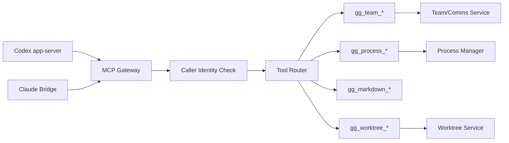

### Tool namespaces

Recommended v1 tool namespaces:

```text
gg_team_status
gg_team_message
gg_team_manage

gg_process_run
gg_process_status
gg_process_logs
gg_process_kill

gg_worktree_status
gg_worktree_create
gg_worktree_claim
gg_worktree_release

gg_markdown_read
gg_markdown_write
gg_markdown_tree
```

Process and worktree tools can also be public HTTP APIs. The MCP path is for provider-agent use.

### Tool invocation invariant

Every provider-originated tool call must include:

```text
caller_session_id
provider
turn_id if available
tool_call_id if available
```

The runtime must reject tool invocations when:

* caller session does not exist
* caller session is closed
* tool namespace is disabled
* tool requires team membership and caller is not a member
* team boundary is violated
* delivery/message operation is malformed
* worktree operation lacks enough context

This is not multi-tenant security. It is runtime correctness.

---

## 18. Process execution model

Process execution is first-class.

### Public process API

```http
POST /v1/processes
GET  /v1/processes
GET  /v1/processes/{process_id}
GET  /v1/processes/{process_id}/logs
POST /v1/processes/{process_id}/kill
```

### Process state machine

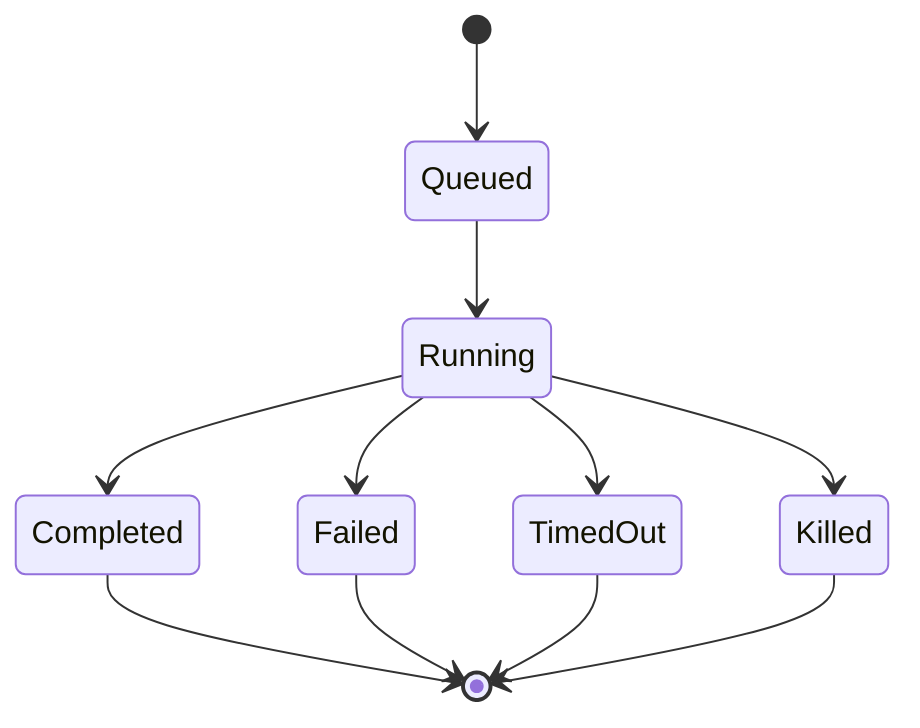

### Recommended behavior

* commands execute on the host machine
* default cwd is session cwd
* stdout/stderr are streamed as runtime events and written to files
* logs are retrievable after completion
* long-running processes remain visible
* processes can be tied to sessions, tool calls, or direct public API invocations
* process completion does not automatically become agent input unless invoked through a tool call that expects a result

### Guardrails

Even though this is single-user and full-machine by design, include config knobs:

```toml
[processes]
enabled = true
default_timeout_ms = 600000
max_concurrent = 32
max_output_bytes_per_process = 20000000
allow_shell = true
```

Default can be powerful, but the operator should be able to constrain it.

---

## 19. Event streaming model

Use a global event stream plus scoped streams.

### Global stream

```http
GET /v1/events/stream
```

Emits everything:

* sessions
* turns
* approvals
* teams
* messages
* deliveries
* processes
* worktrees
* provider lifecycle

### Scoped streams

```http
GET /v1/sessions/{session_id}/events/stream
GET /v1/teams/{team_id}/events/stream
GET /v1/processes/{process_id}/events/stream
```

### SSE event format

```text
id: 1842
event: team_message.created
data: {"event_id":"evt_...","scope":"team","team_id":"team_1","seq":1842,"payload":{...}}
```

### Reconnect

Clients can reconnect with:

```http
Last-Event-ID: 1842
```

or:

```http
GET /v1/events/stream?after_seq=1842
```

### Critical vs droppable

Critical events are persisted and replayable:

```text
session.created
turn.started
approval.requested
approval.resolved
turn.completed
team_message.created
team_delivery.injected
process.completed
worktree.created
```

High-volume deltas can be coalesced:

```text
message.delta
reasoning.delta
process.output
tool_call.delta
```

For process output, use both:

* durable log files
* sampled/coalesced stream events

---

## 20. Auth and credential model

## 20.1 Runtime API auth

Single-user bearer token.

No user registration. No tenant model.

```text
Authorization: Bearer <runtime-token>
```

## 20.2 Codex auth

Support:

* ChatGPT OAuth through Codex app-server
* API key
* status
* logout
* rate limit status

Endpoints:

```http
GET  /v1/providers/codex/auth/status
POST /v1/providers/codex/auth/start
POST /v1/providers/codex/auth/api-key
POST /v1/providers/codex/auth/cancel
POST /v1/providers/codex/auth/logout
```

The runtime owns a Codex home directory:

```text
~/.gg-runtime/providers/codex/home
```

## 20.3 Claude auth

Support:

* Anthropic API key
* imported Claude Code `auth.json`
* pasted JSON text
* uploaded file
* logout/status

Endpoints:

```http
GET  /v1/providers/claude/auth/status
POST /v1/providers/claude/auth/api-key
POST /v1/providers/claude/auth/import-json
POST /v1/providers/claude/auth/import-file
POST /v1/providers/claude/auth/logout
```

Runtime-managed path:

```text
~/.gg-runtime/providers/claude/config/auth.json
```

Every Claude bridge gets:

```text
CLAUDE_CONFIG_DIR=~/.gg-runtime/providers/claude/config
```

No hosted OAuth. No callback. No device code unless Claude Code provides one cleanly later.

---

## 21. Concurrency and scaling model

Since this is one machine / one owner, scaling means:

* multiple concurrent sessions
* multiple concurrent provider processes
* multiple agents in one team
* concurrent tool/process execution
* event fan-out to multiple clients

Not multi-node distributed scaling.

### Preserve these optimizations

* Codex pooled transports
* Claude bridge process pool
* bounded provider queues
* fail-closed routing ownership
* critical event forwarding
* per-recipient comms injection guard
* per-repo worktree lock
* process concurrency limits
* durable event log replay
* idempotency keys for team operations/messages

### Recommended default limits

```toml
[runtime]
max_sessions = 64
max_active_turns = 32

[codex]
max_transports = 4
max_sessions_per_transport = 8

[claude]
max_bridges = 4
max_sessions_per_bridge = 4
heartbeat_interval_ms = 5000
heartbeat_failure_threshold = 3

[comms]
delivery_executor_workers = 4
max_pending_deliveries = 10000

[processes]
max_concurrent = 32

[events]
live_queue_capacity = 4096
```

---

## 22. Failure handling and recovery

### Startup recovery

On startup:

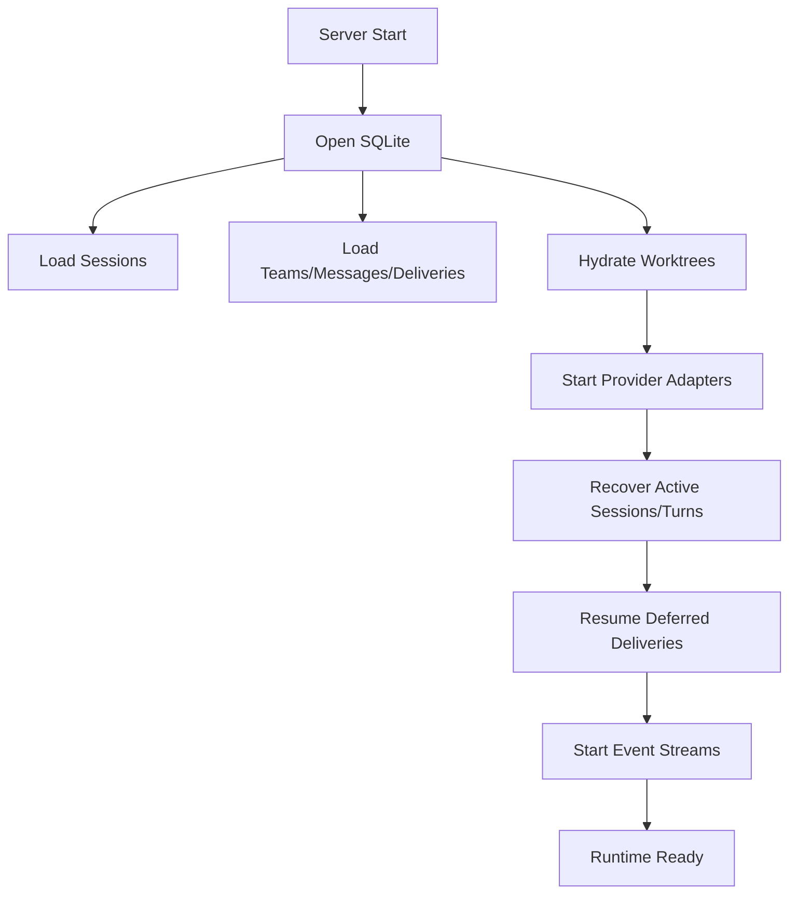

### Provider process crash

When Codex app-server or Claude bridge exits:

1. mark transport/bridge failed
2. fail pending requests
3. emit provider error event
4. mark affected turns recovering
5. attempt provider-specific resume/inspection
6. terminally mark as recovered, failed, or desynced
7. keep sessions queryable

### Delivery failure

Delivery failure should not destroy messages.

A message can have:

* one successful recipient
* one deferred recipient
* one failed recipient

Clients should inspect deliveries independently.

### Worktree operation failure

Worktree teammate-add failures need a journal.

For `spawn member with worktree`, record stages:

```text
planned
branch_created
worktree_created
init_script_succeeded
session_created
team_joined
onboarding_sent
completed
rolled_back
failed_partial
```

If failure happens after branch/worktree creation, attempt rollback. If rollback fails, expose diagnostics.

### Interrupt failure

Interrupt is not terminal. Preserve the current robust pattern:

1. persist interrupt request
2. send provider interrupt
3. wait for terminal event
4. inspect provider state if possible
5. reconcile or mark desynced

### Event queue overload

* never drop critical state transitions
* coalesce deltas
* preserve process logs on disk
* allow stream clients to replay from durable event log

---

## 23. Recommended MVP scope

The revised MVP should include team/comms and worktrees from the beginning.

### MVP includes

* one binary: `gg-runtime-server`
* HTTP OpenAPI API
* bearer token auth
* SQLite persistence
* event log
* SSE streams
* Codex provider
* Claude provider through Bun sidecar
* Codex OAuth and API key auth
* Claude API key and imported `auth.json` auth
* sessions
* turns
* approvals
* events
* process manager
* MCP gateway
* `gg_process_*` tools
* teams
* team membership
* direct messages
* broadcast messages
* delivery records
* delivery retry/cancel
* `gg_team_status`
* `gg_team_message`
* `gg_team_manage`
* teammate spawning
* managed git worktrees
* worktree init script
* worktree cleanup on member removal
* team view snapshots
* diagnostics

### MVP can defer

* polished Rust client SDK
* gRPC
* multi-user accounts
* tenant isolation
* hosted OAuth for Claude
* distributed workers
* Postgres
* browser UI
* mobile SDK
* marketplace/plugin system
* advanced UI timeline projections
* hard fork/session branching

---

## 24. MVP milestones

1. Build `runtime-core` state types and invariants for sessions, turns, events, approvals, teams, messages, deliveries, worktrees, and processes.

2. Build SQLite store with migrations for all MVP state.

3. Build event bus with durable append, scoped sequence numbers, and SSE replay.

4. Build HTTP server skeleton with OpenAPI generation.

5. Implement runtime API auth with static bearer token.

6. Implement Codex provider adapter with app-server transport pool.

7. Implement Codex auth: OAuth start/status/cancel/logout and API key.

8. Implement session create/list/get/close and turn send/interrupt.

9. Implement approval persistence and approval response.

10. Implement `gg-mcp-server` gateway and tool router.

11. Implement process manager and `gg_process_*` tools.

12. Implement team service: create/list/get/join/remove/set lead/delete.

13. Implement comms broker: direct/broadcast messages, deliveries, idempotency, injection guard, retry/cancel.

14. Implement `gg_team_status` and `gg_team_message`.

15. Implement managed worktree service: create, claim, release, cleanup, startup repair.

16. Implement `gg_team_manage add/remove`, including teammate spawn and worktree flow.

17. Implement Claude bridge sidecar protocol and Rust adapter.

18. Implement Claude auth via API key and imported `auth.json`.

19. Add recovery: startup sessions, active turns, deferred deliveries, worktree records, provider process crashes.

20. Add diagnostics endpoints for providers, comms, team operations, worktrees, processes.

---

## 25. Top risks

* Claude Code sidecar protocol drift or SDK behavior changes.
* Imported Claude `auth.json` format changes.
* Codex app-server protocol changes.
* Team delivery injection races with active turns.
* Worktree rollback complexity after partial failure.
* Long-running process logs can overwhelm event streams.
* Public API exposure with full-machine execution is dangerous if runtime token leaks.
* Provider event routing bugs can corrupt session state.
* Restart during teammate spawn can leave partial worktree/session/team state.
* Claude bridge process failures may be harder to recover than Codex transports.

---

## 26. Direct recommendation for starting point

### First crate to build

Build:

```text
runtime-core
```

But include team/comms types immediately. Do not build a session-only core and retrofit teams later.

The first core module set should be:

```text
ids
error
events
sessions
turns
approvals
teams
comms
deliveries
worktrees
processes
provider
```

### First persistence schema to create

Create SQLite tables for:

```text
sessions
turns
runtime_events
approvals
teams
team_members
team_messages
team_deliveries
managed_worktrees
managed_worktree_claims
processes
credentials
```

### First provider to support

Start with:

```text
Codex
```

Codex has the clearest Rust-side integration path and best current backend architecture.

### First auth flow to implement

Implement:

```text
Codex ChatGPT OAuth
```

Then immediately:

```text
Codex API key
Claude API key
Claude auth.json import
```

Claude `auth.json` import should be a first-class endpoint, not a workaround.

### First API endpoints to ship

Ship this first vertical slice:

```text
GET  /health
GET  /version

GET  /v1/providers
GET  /v1/providers/{provider}/models

GET  /v1/providers/codex/auth/status
POST /v1/providers/codex/auth/start
POST /v1/providers/codex/auth/api-key
POST /v1/providers/codex/auth/cancel
POST /v1/providers/codex/auth/logout

GET  /v1/providers/claude/auth/status
POST /v1/providers/claude/auth/api-key
POST /v1/providers/claude/auth/import-json

POST /v1/sessions
GET  /v1/sessions
GET  /v1/sessions/{session_id}
POST /v1/sessions/{session_id}/turns
GET  /v1/sessions/{session_id}/events/stream
POST /v1/sessions/{session_id}/turns/{turn_id}/interrupt
POST /v1/sessions/{session_id}/approvals/{approval_id}
POST /v1/sessions/{session_id}/close

POST /v1/teams
GET  /v1/teams
GET  /v1/teams/{team_id}
POST /v1/teams/{team_id}/messages
POST /v1/teams/{team_id}/broadcasts
GET  /v1/teams/{team_id}/view
GET  /v1/teams/{team_id}/events/stream

POST /v1/processes
GET  /v1/processes/{process_id}
GET  /v1/processes/{process_id}/logs
POST /v1/processes/{process_id}/kill
```

### First end-to-end demo to prove

The first real demo should be:

1. Start `gg-runtime-server` on a VPS.
2. Authenticate Codex.
3. Authenticate Claude by pasting/importing `auth.json`.
4. Create a Codex lead session in a git repo.
5. Create a team around that lead.
6. Spawn a Claude teammate in a new managed git worktree.
7. Send the teammate an onboarding message.
8. Stream all events to a simple web client.
9. Have the teammate run a process through `gg_process_run`.
10. Send a direct message back to the lead through `gg_team_message`.
11. Remove the teammate and cleanup the worktree.

That demo exercises the actual product thesis: **clients control a team of provider-agnostic agents that can communicate and do real work on a hosted machine.**
